# NURDVision Alpha
## This is an archive. Development continued in [master branch](https://github.com/FRCTeam3255/NURDVision/tree/master)
First SuperNURDs implementation of vision co-processing on the Jetson TK1

This is the runnable program and setup of NURDVision, to see a simple implementation example on an FRC Robot visit:

**(Coming Soon)** [NURDVisionRobot GitHub]

Major resource used - [SMblyRequired](https://github.com/SMblyRequired/Computer-Vision-2017)

## Table of contents
- [How to Set Up on the Jetson TK1](#how-to-set-up-on-the-jetson-tk1)
- [Jetson NURDVision Installation](#jetson-nurdvision-installation)
- [Linux PC NURDVision Installation](#linux-pc-nurdvision-installation)
- [Custom Command Info](#custom-command-info)
- [Additional Info](#additional-info)
- [C++ Compiler arguments (nurdcompile)](#c-compiler-arguments-nurdcompile)

### TO DO:
- Add boiler vs peg detection
- Have jetson send failed camera message to roborio
- Add how to see jetson from roboRIO to read me.
- Run NURDVision on Jetson boot (Check to see if working properly on fresh jetson)
- Move readme conents to wiki pages (maybe)
- ~~Have HSL constants get data from robotPreferences or main code for tuning at competition~~ **COMPLETED**
- ~~Implement CSCore to send video data to roborio/driverstation for tuning at competition~~ **COMPLETED**
- ~~Implement network tables~~ **COMPLETED**

## How to Set Up on the Jetson TK1
What you will need: a Jetson TK1, the provided Micro USB cable, a PC running UBUNTU 64 bit, a monitor or TV, ethernet access to same network as your UBUNTU PC, a mouse and keyboard with a USB hub, a webcam(works best with an LED ring), and the provided 12v power supply

### Jetson initial setup and flashing:

__Step 1__: Plug micro usb cable into the jetson (small side into the port next to audio jacks, and the large side into your PC running UBUNTU).

__Step 2__: Plug in TV, webcam, ethernet and Mouse/Keyboard to jetson

__Step 3__: Turn jetson into recovery mode by holding down the recovery button and pressing restart (if the jetson is on already) or power off (if the jetson is off)

__Step 4__: Open up console (terminal) on your LINUX computer

__Step 5__: Type lsusb into the ubuntu PC's console and check to make sure that there is a NVidia device plugged in

__Step 6__: Download flashJetson.run Type (and then click enter, password: ubuntu): 
	
	mkdir jetsonInstall; cd jetsonInstall; wget https://github.com/FRCTeam3255/NURDVision/raw/alpha/flashJetson.run; bash ./flashJetson.run
	
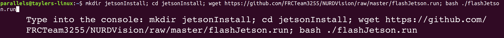

__Step 7__: Continue through the user intuitive flashing process (this may take a few hours) selecting Jetson Tk1 where available (Detailed steps below).

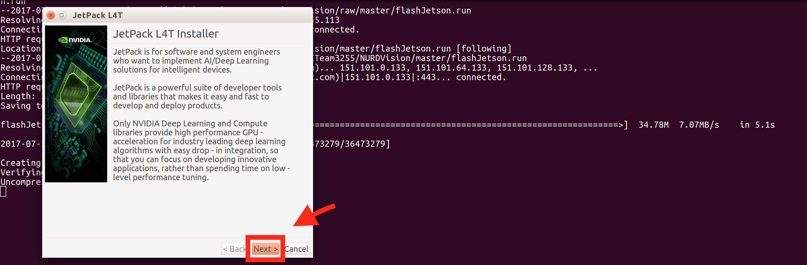
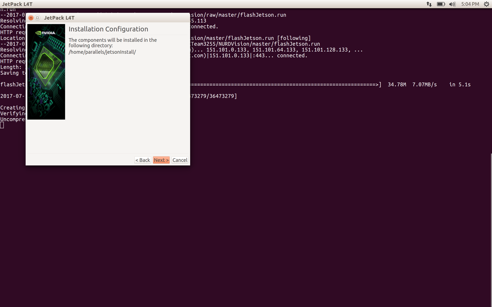
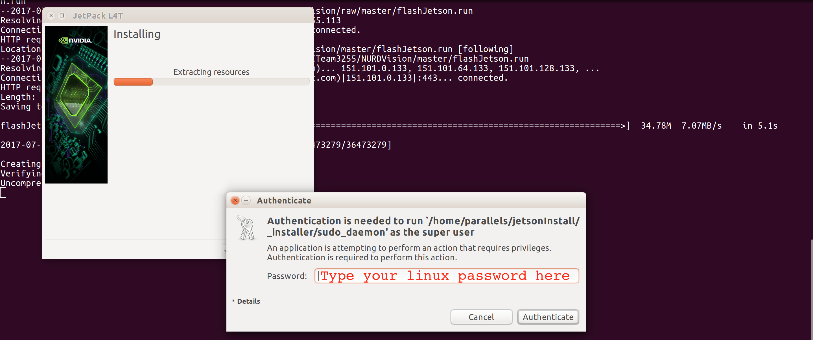
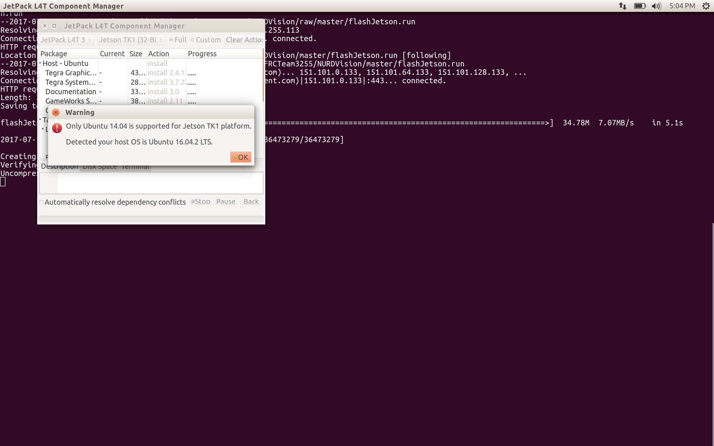

> _**DO NOT INSTALL OPENCV OR ANY SAMPLES AT THIS POINT**_. 

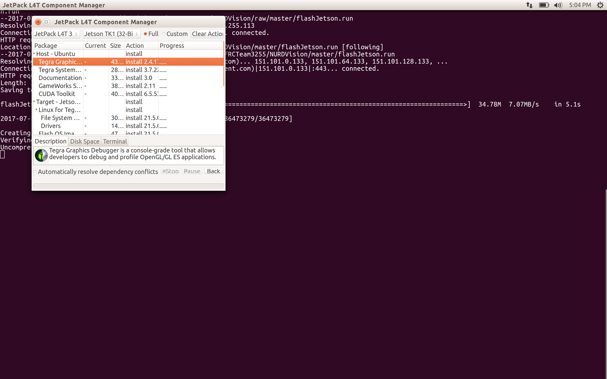
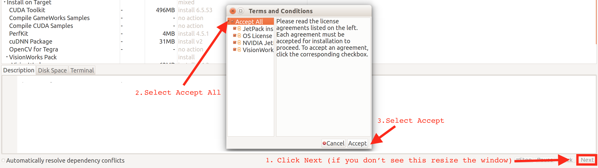
(This may take a while)
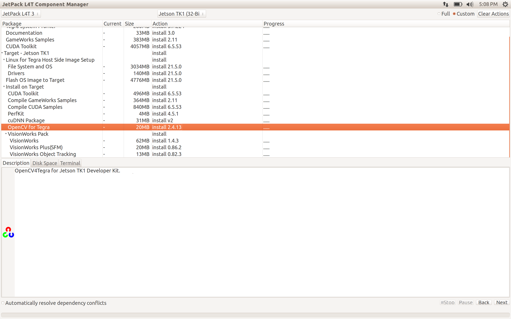
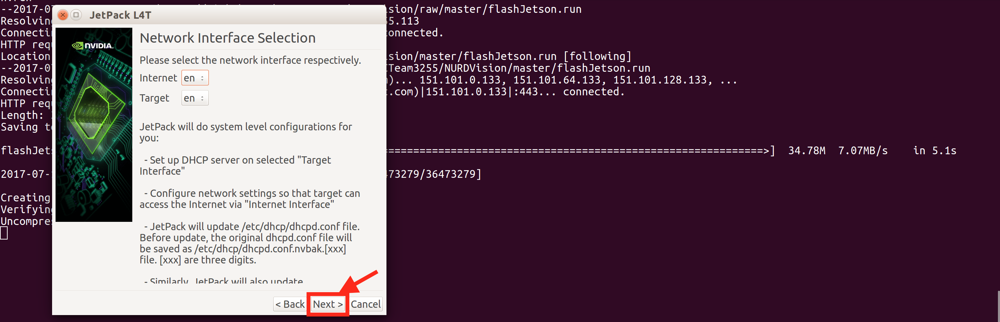
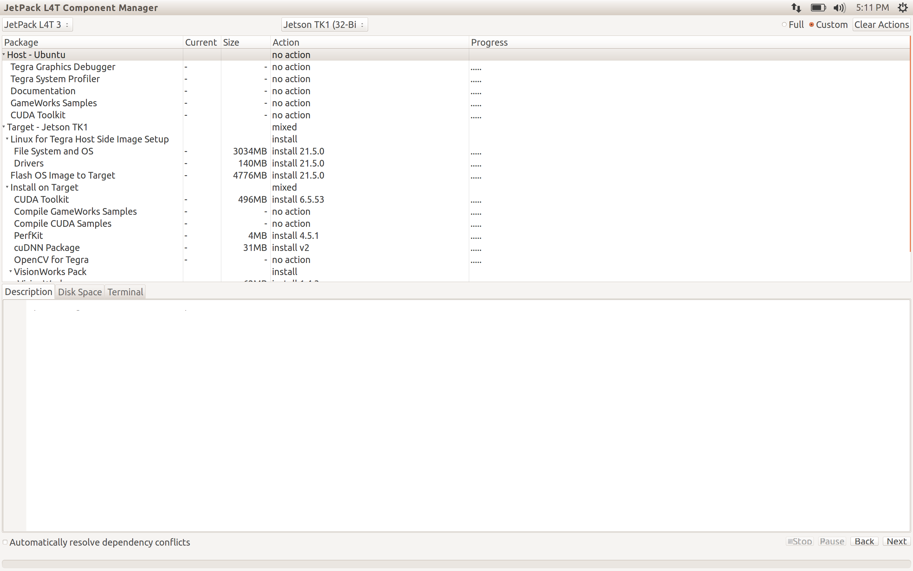
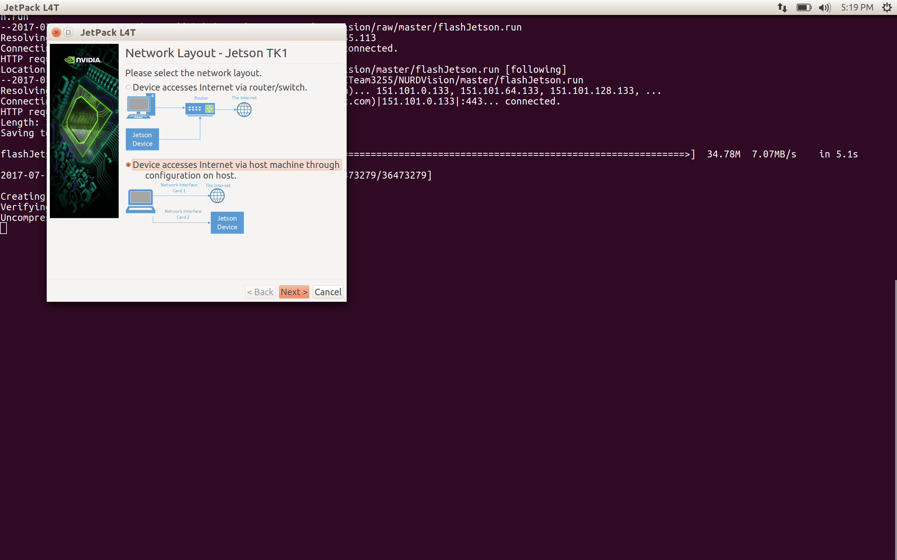
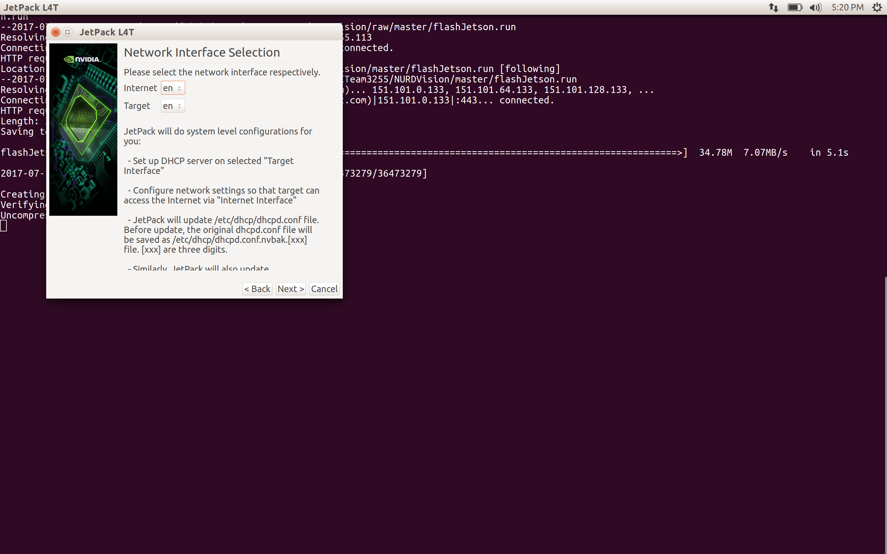

It should say flash succesfull.

~~You may be asked to enter an ip address. On the jetson type: `ifconfig` then type result inte addr: (example 192.168.0.0) into the prompt on your LINUX computer. Click continue.~~

_Jetson intial setup complete!_

### Jetson NURDVision installation: 
**Access to the internet is required - make sure the Jetson is connected to the internet via ethernet**

A PC is no longer needed as this work is done on the Jetson itself.
Alterantively this can be done via ssh (password ubuntu) by typing:
	
	ssh ubuntu@tegra-ubuntu.local

__Step 1__: Download install.sh to jetson and run it. Type: 
	
	wget https://github.com/FRCTeam3255/NURDVision/raw/alpha/install.sh; bash ./install.sh

(this may take a few hours)

__Step 2__: once complete you can now download the latest code, compile and run it. Restart the terminal then type:

	nurdall

_Jetson NURDVision installation complete!_

### Linux PC NURDVision installation:
**This is for LINUX computers ONLY - tested on ubuntu only**

Use these steps if you would like to develop and test on a Linux PC rather than just the Jetson itself.

__Step 1__: Download install-pc.sh to your computer and run it. Type: 
	
	wget https://github.com/FRCTeam3255/NURDVision/raw/alpha/install-pc.sh; bash ./install-pc.sh

(this may take a few hours)

__Step 2__: once complete you can now download the latest code, compile and run it. Restart the terminal then type:

	nurdall

_Jetson NURDVision installation complete!_

### Custom command info:
Our install script adds a custom .bash_aliases file allowing you to use the custom commands below (requires terminal restart):

	nurdget 		downloads latest NURDVision from github
	nurdcompile		compliles NURDVision as runNURDVision
	nurdrun			runs runNURDVision
	nurdrun	-debug		runs runNURDVision with viewer
	nurdrun	-local		runs runNURDVision with localhost set as IP for NetworkTables for debugging locally
		
	nurdall			runs nurdget, nurdcompile, and nurdrun -debug;

These commands can be run invidually if needed (i.e. only nurdget and nurdall require an internet connection)

Any questions contact Mike at the SuperNURDs by leaving an issue report on our Github.

### Additional info:
The Jetson TK1 requires ARM-HF libraries, as such, those are the libraries installed with the install script.

Our install script sets NURDVision to run at startup and disables desktop GUI running on the jetson, which slows down vision processing.

To make NURDVision communicate with a roboRIO other than FRC Team 3255's edit NURDVision.cpp with either SSH or FTP and change
	
	const int teamNumber = YOUR TEAM NUMBER;
	
We found that network tables are hosted on the ip: 10.te.am.43 port 1735

When using the jetson, the camera stream is available at tegra-ubuntu.local:1180 (port number can be changed in the code)

#### C++ Compiler arguments (nurdcompile)
	g++ NURDVision.cpp -std=c++11 -lopencv_calib3d -lopencv_core -lopencv_features2d -lopencv_flann -lopencv_highgui -lopencv_imgcodecs -lopencv_imgproc -lopencv_ml -lopencv_objdetect -lopencv_photo -lopencv_shape -lopencv_stitching -lopencv_superres -lopencv_video -lopencv_videoio -lopencv_videostab -lntcore -lwpiutil -lcscore -o runNURDVision
